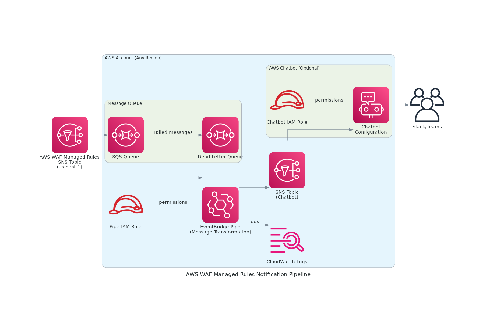

# AWS WAF Managed Rules Deployment Notifier

[English version](README.md)

AWS WAF Managed Rulesの更新通知をAWS Chatbot経由でSlack/Teamsに配信するためのCloudFormationテンプレート

## 概要

このプロジェクトは、AWS WAF Managed Rulesの更新通知を受信し、AWS Chatbotを通じてSlackやTeamsなどのコラボレーションツールに通知を送信するサーバーレスソリューションです。EventBridge Pipesを使用してメッセージを変換し、コードメンテナンスが不要な構成を実現しています。

AWS WAF Managed Rulesは定期的に更新され、新しい脅威への対応や誤検知の修正が行われます。このソリューションにより、これらの更新をリアルタイムで把握し、必要に応じて迅速に対応できます。

## アーキテクチャ



### コンポーネント

- **SQS Queue**: AWS WAF SNS Topicからのメッセージを受信
- **EventBridge Pipes**: メッセージをChatbot形式に変換（ノーコード）
- **SNS Topic**: 変換されたメッセージをChatbotに配信
- **AWS Chatbot**: Slack/Teamsへの通知を管理
- **Dead Letter Queue**: 失敗したメッセージの保管

## 特徴

- 🚀 **完全サーバーレス**: Lambda関数不要
- 🛠️ **メンテナンスフリー**: コード管理不要
- 💰 **低コスト**: 月数回の更新なら実質無料
- 🔄 **自動リトライ**: DLQ付きで信頼性向上
- 📊 **カスタマイズ可能**: メッセージフォーマットを簡単に変更可能
- 🎨 **リッチフォーマット**: Slackマークダウン対応、スレッド化、キーワード検索対応

## セットアップ

### 前提条件

　- （オプション）Slackワークスペースを設定する場合には、ワークスペースの認証と対象のチャンネルに`Amazon Q Developer`のアプリを追加してください。  
    https://docs.aws.amazon.com/ja_jp/chatbot/latest/adminguide/slack-setup.html#slack-client-setup

### サポートリージョン

現時点で、AWS WAF Managed Rulesの更新通知SNSトピックは`us-east-1`リージョンでのみ利用可能です。ただし、このソリューションは他のリージョンにもデプロイ可能で、クロスリージョンでSNSサブスクリプションを作成します。

### デプロイ手順

1. **AWS WAF SNSトピックARNの取得**

   以下のコマンドでAWS WAF Managed Rulesの更新通知を受信できるSNSトピックARNを取得します：

   ```bash
   aws wafv2 describe-managed-rule-group --scope REGIONAL --vendor-name AWS --name AWSManagedRulesCommonRuleSet --region us-east-1 --query 'SnsTopicArn' --output text
   ```

   または、CloudFrontスコープの場合：

   ```bash
   aws wafv2 describe-managed-rule-group --scope CLOUDFRONT --vendor-name AWS --name AWSManagedRulesCommonRuleSet --region us-east-1 --query 'SnsTopicArn' --output text
   ```

2. **パラメータファイルの編集**

   `parameters.json`を編集して、必要な設定を行います  
   `WafSnsTopicArn`にStep 1で確認したARNを設定し、`WafSnsTopicRegion`に`WafSnsTopicArn`のリージョンを設定してください。AWSによる変更がない限りは、デフォルトのままで問題はないはずです。  
   Slackを設定しない場合、Parametersから該当の箇所削除してください。CloudFormationはSlackへの接続設定の作成をスキップします。

   ```json
    [
      {
        "ParameterKey": "WafSnsTopicArn",
        "ParameterValue": "arn:aws:sns:us-east-1:248400274283:aws-managed-waf-rule-notifications"
      },
      {
        "ParameterKey": "WafSnsTopicRegion",
        "ParameterValue": "us-east-1"
      },
      {
        "ParameterKey": "ChatbotWorkspaceId",
        "ParameterValue": "YOUR_SLACK_WORKSPACE_ID"
      },
      {
        "ParameterKey": "ChatbotChannelId",
        "ParameterValue": "YOUR_SLACK_CHANNEL_ID"
      }
    ]
   ```

3. **CloudFormationスタックのデプロイ**

    スタック名およびデプロイ先のリージョンは任意です。

   ```bash
   aws cloudformation create-stack \
     --stack-name waf-managed-rules-notifier \
     --template-body file://template.yaml \
     --parameters file://parameters.json \
     --capabilities CAPABILITY_NAMED_IAM \
   ```

## 通知フォーマット

通知は以下の形式で配信されます：

```
🛡️ AWS WAF Managed Rules Update

ℹ️ New version available for rule group AWSManagedRulesCommonRuleSet

📦 Rule Group: AWSManagedRulesCommonRuleSet
🏷️ Version: v2

📝 Details:
Welcome to AWSManagedRulesCommonRuleSet version 2.5! This update includes
improved protection against SQL injection and XSS attacks.

🕐 Timestamp: 2025-09-30T10:00:00.000Z
```

## モニタリング

### CloudWatch Logs

EventBridge Pipeのログは以下で確認できます：

```bash
aws logs tail /aws/vendedlogs/pipes/waf-managed-rules-notifier-waf-notification-pipe
```

### Dead Letter Queue

失敗したメッセージの確認：

```bash
aws sqs receive-message \
  --queue-url https://sqs.us-east-1.amazonaws.com/YOUR_ACCOUNT_ID/waf-managed-rules-notifier-waf-notifications-dlq
```

## トラブルシューティング

### 通知が届かない場合

1. SNSサブスクリプションが確認済みか確認
2. SQSキューにメッセージが到達しているか確認
3. EventBridge Pipeのログでエラーを確認
4. Chatbotの設定を確認

### メッセージフォーマットの変更

`template.yaml`の`InputTemplate`セクションを編集して、メッセージフォーマットをカスタマイズできます。

利用可能なフィールド：
- `$.body.Subject` - 更新の概要
- `$.body.Message` - 更新の詳細内容
- `$.body.MessageAttributes.managed_rule_group.Value` - ルールグループ名
- `$.body.MessageAttributes.major_version.Value` - バージョン番号
- `$.body.Timestamp` - 更新通知のタイムスタンプ

AWS Chatbot カスタム通知スキーマの詳細は[公式ドキュメント](https://docs.aws.amazon.com/chatbot/latest/adminguide/custom-notifs.html)を参照してください。

### テスト方法

テストメッセージを送信して動作確認できます：

```bash
# テストメッセージを作成
cat > /tmp/test-message.json << 'EOF'
{
  "Type": "Notification",
  "MessageId": "test-message-12345",
  "TopicArn": "arn:aws:sns:us-east-1:248400274283:aws-managed-waf-rule-notifications",
  "Subject": "New version available for rule group AWSManagedRulesCommonRuleSet",
  "Message": "Welcome to AWSManagedRulesCommonRuleSet version 2.5! This update includes improved protection against SQL injection and XSS attacks.",
  "Timestamp": "2025-09-30T10:00:00.000Z",
  "SignatureVersion": "1",
  "Signature": "EXAMPLE",
  "SigningCertURL": "https://sns.us-east-1.amazonaws.com/cert.pem",
  "UnsubscribeURL": "https://sns.us-east-1.amazonaws.com/unsubscribe",
  "MessageAttributes": {
    "major_version": {
      "Type": "String",
      "Value": "v2"
    },
    "managed_rule_group": {
      "Type": "String",
      "Value": "AWSManagedRulesCommonRuleSet"
    }
  }
}
EOF

# SQS キューに送信
# --stack-nameはデプロイ時に設定したものに変更すること
aws sqs send-message \
  --queue-url $(aws cloudformation describe-stacks --stack-name waf-managed-rules-notifier --query 'Stacks[0].Outputs[?OutputKey==`QueueUrl`].OutputValue' --output text) \
  --message-body file:///tmp/test-message.json
```

## リソースのクリーンアップ

不要になった場合は、以下のコマンドでリソースを削除できます。  
スタック名はデプロイした際の名前です。

```bash
aws cloudformation delete-stack --stack-name waf-managed-rules-notifier
```

## コスト

月数回の更新の場合、実質的にコストは発生しません。

- SQS: 最初の100万リクエスト無料
- EventBridge Pipes: $0.40/100万リクエスト
- SNS: 最初の100万リクエスト無料
- CloudWatch Logs: 最初の5GB無料

## ライセンス

このプロジェクトはMITライセンスの下でライセンスされています。詳細は[LICENSE](LICENSE)ファイルを参照してください。
