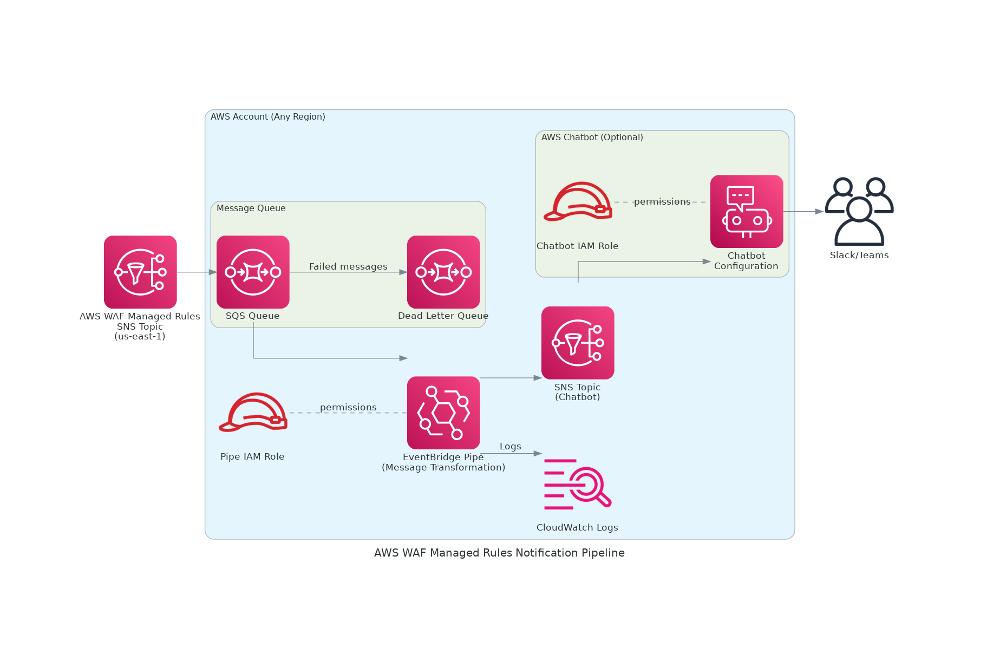

# AWS WAF Managed Rules Deployment Notifier

[日本語版はこちら / Japanese version](README.ja.md)

CloudFormation template for delivering AWS WAF Managed Rules update notifications to Slack/Teams via AWS Chatbot

## Overview

This project provides a serverless solution that receives AWS WAF Managed Rules update notifications and delivers them to collaboration tools like Slack and Teams through AWS Chatbot. By using EventBridge Pipes for message transformation, it achieves a code-maintenance-free architecture.

AWS WAF Managed Rules are regularly updated with responses to new threats and fixes for false positives. This solution enables you to stay informed about these updates in real-time and respond quickly when necessary.

## Architecture



### Components

- **SQS Queue**: Receives messages from AWS WAF SNS Topic
- **EventBridge Pipes**: Transforms messages into Chatbot format (no-code)
- **SNS Topic**: Delivers transformed messages to Chatbot
- **AWS Chatbot**: Manages notifications to Slack/Teams
- **Dead Letter Queue**: Stores failed messages

## Features

- 🚀 **Fully Serverless**: No Lambda functions required
- 🛠️ **Maintenance-Free**: No code management needed
- 💰 **Low Cost**: Essentially free for a few updates per month
- 🔄 **Automatic Retry**: Improved reliability with DLQ
- 📊 **Customizable**: Easy to modify message format
- 🎨 **Rich Formatting**: Slack markdown support, threading, and keyword search

## Setup

### Prerequisites

- (Optional) If configuring a Slack workspace, complete workspace authentication and add the `Amazon Q Developer` app to the target channel.
  https://docs.aws.amazon.com/chatbot/latest/adminguide/slack-setup.html#slack-client-setup

### Supported Regions

Currently, the AWS WAF Managed Rules update notification SNS topic is only available in the `us-east-1` region. However, this solution can be deployed to other regions and creates cross-region SNS subscriptions.

### Deployment Steps

1. **Get AWS WAF SNS Topic ARN**

   Use the following command to retrieve the SNS topic ARN for AWS WAF Managed Rules update notifications:

   ```bash
   aws wafv2 describe-managed-rule-group --scope REGIONAL --vendor-name AWS --name AWSManagedRulesCommonRuleSet --region us-east-1 --query 'SnsTopicArn' --output text
   ```

   Or for CloudFront scope:

   ```bash
   aws wafv2 describe-managed-rule-group --scope CLOUDFRONT --vendor-name AWS --name AWSManagedRulesCommonRuleSet --region us-east-1 --query 'SnsTopicArn' --output text
   ```

2. **Edit Parameters File**

   Edit `parameters.json` to configure the necessary settings.
   Set the ARN obtained in Step 1 to `WafSnsTopicArn` and the region of the `WafSnsTopicArn` to `WafSnsTopicRegion`. The default values should work unless AWS changes the topic ARN.
   If not configuring Slack, remove the relevant entries from Parameters. CloudFormation will skip creating the Slack connection settings.

   ```json
    [
      {
        "ParameterKey": "WafSnsTopicArn",
        "ParameterValue": "arn:aws:sns:us-east-1:248400274283:aws-managed-waf-rule-notifications"
      },
      {
        "ParameterKey": "WafSnsTopicRegion",
        "ParameterValue": "us-east-1"
      },
      {
        "ParameterKey": "ChatbotWorkspaceId",
        "ParameterValue": "YOUR_SLACK_WORKSPACE_ID"
      },
      {
        "ParameterKey": "ChatbotChannelId",
        "ParameterValue": "YOUR_SLACK_CHANNEL_ID"
      }
    ]
   ```

3. **Deploy CloudFormation Stack**

   You can choose any stack name and deployment region.

   ```bash
   aws cloudformation create-stack \
     --stack-name waf-managed-rules-notifier \
     --template-body file://template.yaml \
     --parameters file://parameters.json \
     --capabilities CAPABILITY_NAMED_IAM
   ```

## Notification Format

Notifications are delivered in the following format:

```
🛡️ AWS WAF Managed Rules Update

ℹ️ New version available for rule group AWSManagedRulesCommonRuleSet

📦 Rule Group: AWSManagedRulesCommonRuleSet
🏷️ Version: v2

📝 Details:
Welcome to AWSManagedRulesCommonRuleSet version 2.5! This update includes
improved protection against SQL injection and XSS attacks.

🕐 Timestamp: 2025-09-30T10:00:00.000Z
```

## Monitoring

### CloudWatch Logs

You can check EventBridge Pipe logs with:

```bash
aws logs tail /aws/vendedlogs/pipes/waf-managed-rules-notifier-waf-notification-pipe
```

### Dead Letter Queue

Check failed messages:

```bash
aws sqs receive-message \
  --queue-url https://sqs.us-east-1.amazonaws.com/YOUR_ACCOUNT_ID/waf-managed-rules-notifier-waf-notifications-dlq
```

## Troubleshooting

### If Notifications Are Not Received

1. Verify SNS subscription is confirmed
2. Check if messages are reaching the SQS queue
3. Check EventBridge Pipe logs for errors
4. Verify Chatbot configuration

### Customizing Message Format

You can customize the message format by editing the `InputTemplate` section in `template.yaml`.

Available fields:
- `$.body.Subject` - Update summary
- `$.body.Message` - Detailed update content
- `$.body.MessageAttributes.managed_rule_group.Value` - Rule group name
- `$.body.MessageAttributes.major_version.Value` - Version number
- `$.body.Timestamp` - Update notification timestamp

For details on the AWS Chatbot custom notification schema, refer to the [official documentation](https://docs.aws.amazon.com/chatbot/latest/adminguide/custom-notifs.html).

### Testing Method

You can send a test message to verify functionality:

```bash
# Create test message
cat > /tmp/test-message.json << 'EOF'
{
  "Type": "Notification",
  "MessageId": "test-message-12345",
  "TopicArn": "arn:aws:sns:us-east-1:248400274283:aws-managed-waf-rule-notifications",
  "Subject": "New version available for rule group AWSManagedRulesCommonRuleSet",
  "Message": "Welcome to AWSManagedRulesCommonRuleSet version 2.5! This update includes improved protection against SQL injection and XSS attacks.",
  "Timestamp": "2025-09-30T10:00:00.000Z",
  "SignatureVersion": "1",
  "Signature": "EXAMPLE",
  "SigningCertURL": "https://sns.us-east-1.amazonaws.com/cert.pem",
  "UnsubscribeURL": "https://sns.us-east-1.amazonaws.com/unsubscribe",
  "MessageAttributes": {
    "major_version": {
      "Type": "String",
      "Value": "v2"
    },
    "managed_rule_group": {
      "Type": "String",
      "Value": "AWSManagedRulesCommonRuleSet"
    }
  }
}
EOF

# Send to SQS queue
aws sqs send-message \
  --queue-url $(aws cloudformation describe-stacks --stack-name waf-managed-rules-notifier --query 'Stacks[0].Outputs[?OutputKey==`QueueUrl`].OutputValue' --output text) \
  --message-body file:///tmp/test-message.json
```

## Resource Cleanup

If no longer needed, you can delete resources with the following command.
Stack name should match what you used during deployment.

```bash
aws cloudformation delete-stack --stack-name waf-managed-rules-notifier
```

## Cost

For a few updates per month, costs are essentially negligible:

- SQS: First 1 million requests free
- EventBridge Pipes: $0.40 per million requests
- SNS: First 1 million requests free
- CloudWatch Logs: First 5GB free

## License

This project is licensed under the MIT License - see the [LICENSE](LICENSE) file for details.
